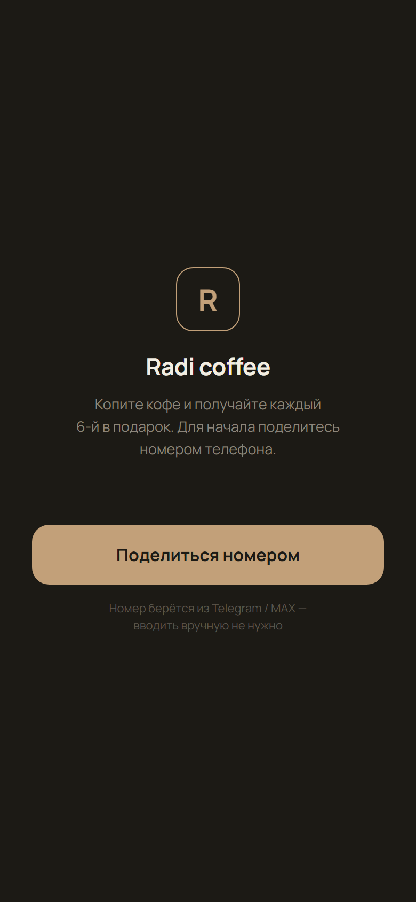
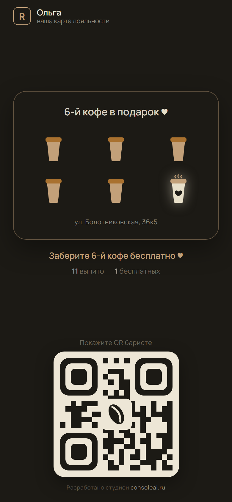
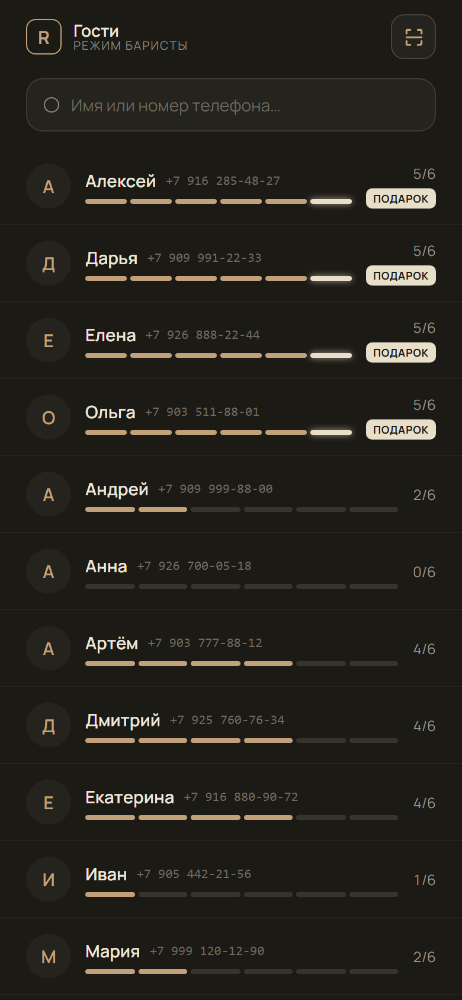
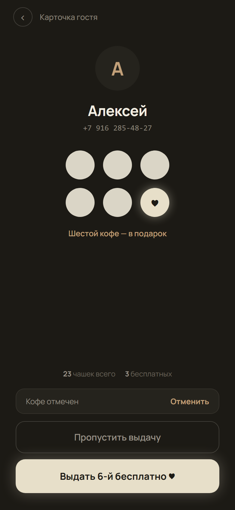
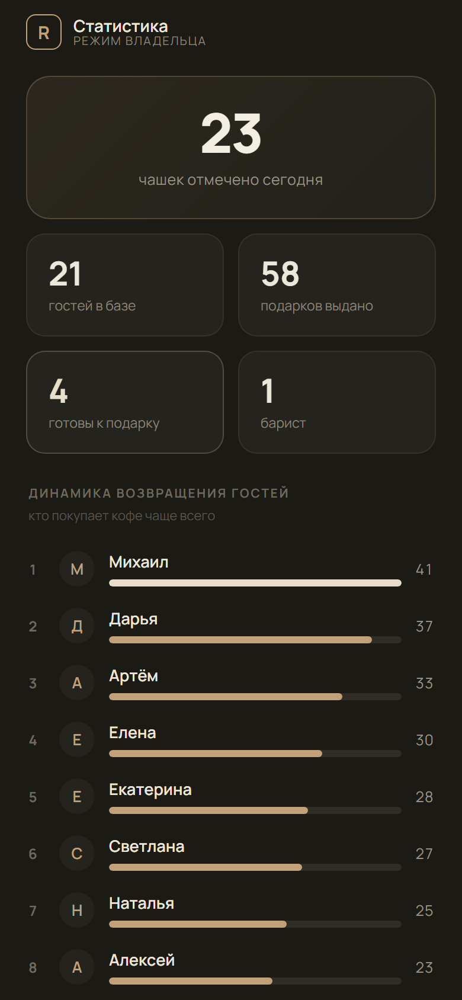
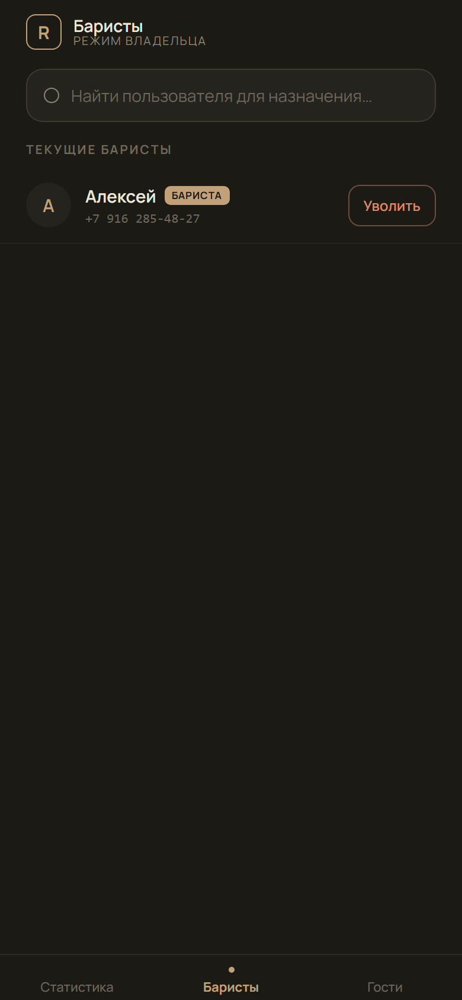

# ☕ Telegram Coffee Loyalty — Radi Coffee

Программа лояльности для кофейни в формате **Telegram Mini App**: «каждый 6-й кофе бесплатно».
Заменяет бумажные карточки-штампы — бариста находит гостя по имени/номеру или скану QR и
отмечает кофе в один тап. Работает в проде для реальной кофейни.


> Одно приложение — три роли, экран определяется ролью аккаунта:
> **Клиент** (карта лояльности + QR) · **Бариста** (поиск гостей, отметка кофе) · **Владелец** (статистика, управление баристами).

---

## 📱 Скриншоты

| Онбординг | Карта клиента | Список гостей (бариста) |
|:---:|:---:|:---:|
|  |  |  |

| Карточка гостя | Статистика (владелец) | Баристы |
|:---:|:---:|:---:|
|  |  |  |

---

## ✨ Возможности

- **Telegram Mini App** с серверной авторизацией через **initData (HMAC-SHA256)** — не доверяем клиенту, проверяем подпись на бэкенде.
- **Три роли** в одном приложении, маршрутизация по роли аккаунта.
- **Логика лояльности** с накоплением и откатом:
  - `+1 кофе`, `выдать 6-й бесплатно`, `пропустить выдачу` (отложить бесплатный в запас, до 5), `выдать из запаса`;
  - каждое действие — через подтверждение, последнее можно **откатить** (журнал действий).
- **Настоящий сканируемый QR** в фирменном стиле (кодирует id аккаунта); скан у баристы — через нативный сканер Telegram.
- **Статистика владельца**: чашек за сегодня, гостей в базе, выдано подарков, рейтинг возвращаемости.
- **Управление баристами**: назначение/увольнение по поиску.
- Номер телефона берётся из Telegram (`request_contact`), вручную не вводится.

---

## 🧱 Стек

**Frontend** — React 18 + Vite, без UI-фреймворка (вёрстка пиксель-в-пиксель по дизайну), `qrcode` для QR.
**Backend** — Python, FastAPI, SQLite (легковесно, без отдельной СУБД).
**Bot** — aiogram 3 (polling), открывает мини-апп через menu-button.
**Деплой** — systemd + nginx + Let's Encrypt.

```
Telegram ──┬─ Mini App (React) ──→ FastAPI ──→ SQLite
           │       ▲  initData (HMAC-SHA256)
           └─ Bot (aiogram) ───────┘
```

---

## 🗂 Структура

```
backend/
  app/
    main.py      # FastAPI: роуты + зависимости авторизации
    auth.py      # проверка Telegram initData (HMAC), нормализация телефона/имени
    service.py   # доменная логика лояльности (атомарно, с журналом действий)
    db.py        # SQLite-слой (WAL, транзакции)
    config.py    # конфиг из окружения
  bot.py         # Telegram-бот (aiogram)
  seed.py        # демо-наполнение для локальной разработки
frontend/
  src/
    App.jsx      # авторизация, онбординг-гейт, роутинг по роли
    api.js       # API-клиент (Authorization: tma <initData>)
    tg.js        # обёртка Telegram WebApp SDK
    screens/     # Onboarding, ClientCard, Barista, Owner, GuestList, GuestCard
    Qr.jsx       # генерация фирменного QR
.github/workflows/ci.yml   # CI: ruff (backend) + eslint & build (frontend)
```

---

## 🚀 Локальный запуск

### Backend
```bash
cd backend
python -m venv .venv && source .venv/bin/activate   # Windows: .venv\Scripts\activate
pip install -r requirements.txt
cp .env.example .env          # подставьте BOT_TOKEN, OWNER_TG_IDS
python seed.py                # демо-данные (20 гостей)
RADI_DEV_AUTH=1 uvicorn app.main:app --port 8011    # DEV_AUTH=1 — вход без проверки подписи (только локально!)
```

### Frontend
```bash
cd frontend
npm install
npm run dev                   # http://localhost:5183, /api проксируется на :8011
```

### Бот
```bash
cd backend
python bot.py                 # нужен валидный BOT_TOKEN
```

---

## 🔐 Авторизация

Клиент шлёт `Authorization: tma <initData>`. Бэкенд:
1. разбирает `initData`, считает HMAC-SHA256 по секрету `HMAC("WebAppData", bot_token)`;
2. сверяет с `hash`, проверяет срок `auth_date`;
3. по `user.id` находит/создаёт аккаунт и применяет роль владельца из `OWNER_TG_IDS`.

В DEV-режиме (`RADI_DEV_AUTH=1`) подпись не проверяется — **только для локальной разработки**.

---

## 📦 API (кратко)

| Метод | Путь | Кто | Назначение |
|---|---|---|---|
| POST | `/api/auth` | все | профиль текущего пользователя (создаёт при первом входе) |
| POST | `/api/me/profile` | все | сохранить имя/телефон (онбординг) |
| GET | `/api/accounts?query=` | staff | поиск гостей |
| POST | `/api/accounts/:id/action` | staff | `cup` / `redeem` / `skip` / `bonus` |
| POST | `/api/accounts/:id/undo` | staff | откат последнего действия |
| POST | `/api/accounts/:id/role` | owner | назначить/снять баристу |
| GET | `/api/stats/today` · `/api/stats/loyalty` | owner | статистика |

---

## 📄 Лицензия

MIT — см. [LICENSE](LICENSE).

> Дизайн реализован по согласованному макету. Подпись «Разработано студией consoleai.ru».
